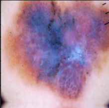
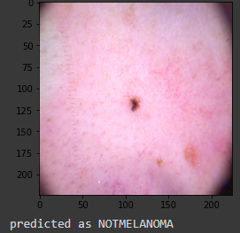

### Brief Overview:
Melanoma is a dangerous form of skin-cancer. Though, it is a rare form of skin-cancer but it is highly fatal.The objective is to create a Convolutional Neural Network (CNN) model to classify a dermoscopic image of a skin lesion as Melanoma or Non-Melanoma.This repository explains the approach and the results in detail.
## Dataset:
#### Directory Structure:
###### test /
          melanoma /
          non-melanoma /
###### train
          melanoma /
          non-melanoma /
###### validation
          melanoma /
          non-melanoma /
            
Data augmentation allows the model to be exposed to various modifications of an image of melanoma.The previously imbalanced 10k images become a 17.8k balanced dataset after the data augmentation of the melanoma group.

Some sample images:
##### Melanoma
 
##### Not Melanoma
 
### Built With
    TensorFlow
    Keras
    Python
### Model:
The Model I have used is RESNET50 using transfer learning.At training,the frozen(untrainable) layers and the top dense layers are trained.Compilation is done using ADAM optimizer and the loss 'binary_crossentropy'.The output images are classified in two classes,0 is for MELANOMA,1 is for NOT having MELANOMA.
The performance of implemented model:

##### Accuracy of Training and Validation data:

##### Loss of Training and Validation data:

## Model's performance at testing:
test acc: 0.949999988079071
test loss: 1.5819216966629028

## Sample Test Images:
   
